+++
title = "Criando seu blog com Zola e hospedando de graça na Netlify"
description = "Crie seu blog a partir do git sem gastar nada!"
date=2019-11-13
draft = false
slug = "criando-seu-blog-com-zola-e-hospedando-de-graca-na-netlify"

[taxonomies]
categories = ["Dicas"]
tags = ["blog", "zola", "rust", "static-site"]

[extra]
author = "rochacbruno"
comments = true
+++

{{ resize_image(path="../static/hands_in_show.png", class='top') }}

Esta postagem inaugura este blog e para começar nada melhor do que explicar
a tecnologia utilizada para o gerenciamento do conteúdo por aqui e também falar sobre 
os motivos que me levaram a adotar esta estratégia.

---

# Criando seu blog com Zola e hospedando de graça na Netlify

A forma mais prática para publicar blogs, especialmente se o blog for de uma pessoa desenvolvedora é a utilização de sites estáticos, são inúmeras as vantagens dessa abordagem.

Os motivos que nos levam a escolher sites estáticos ao invés de um **CMS** completo incluem a simplicidade da linguagem **Markdown**, a possibilidade de armazenar o conteúdo gratuitamente em um repositório do **Github** ou **Gitlab**, a rapidez na renderização do conteúdo, a facilidade na migração caso precise mudar de servidor, a hospedagem gratuita em serviços como [Netlify](http://netlify.com) ou Github Pages e é claro não ter que manter bancos de dados e servidores web.

Eu mesmo já tentei criar meu próprio CMS algumas vezes ([1](http://github.com/opps), [2](http://github.com/rochacbruno-archive/quokka)) e no final das contas percebi que eu não preciso de um **CMS** complexo e você provavelmente também não.

## Componentes

Estes são os componentes que usaremos nesta solução.

- [Markdown](https://www.markdownguide.org/cheat-sheet/) - Linguagem de marcação para o conteúdo.
- [Git](https://git-scm.com/) (github/gitlab) - Repositório onde o conteúdo será armazenado.
- [Zola](https://getzola.org) - Ferramenta que irá gerar o site estatico a partir dos arquivos markdown.
- [Github UI](https://help.github.com/en/github/writing-on-github/about-writing-and-formatting-on-github) ou seu editor favorito - Local onde escreveremos novos posts no blog.
- [Netlify](https://netlify.com) - Serviço de hospedagem que fará os deploys automaticamente do blog.

## Zola

O [Zola](http://getzola.org) é um programa escrito em [Rust](http://rustlang.org) para a geração de sites estáticos, com ele é possivel criar sites, single page apps e também blogs.

Eu estava a procura de um gerador de sites estáticos para construir este blog e como estou
bastante interessado em praticar com **Rust** eu fui ao [AwesomeRust](https://github.com/awesome-rust-com/awesome-rust) e fiz uma busca por **static-site** e nesta lista estava o **Zola**.

Dei uma rápida olhada em seu [código fonte](https://github.com/getzola/zola) para saber se eu teria condições de contribuir para o projeto caso viesse a adotar.

Algumas coisas me fizeram escolher o **Zola**

- Escrito em **Rust** (motivo para praticar e contribuir)
- Markdown!!!
- Binário único `$ zola` com tudo incluido para gerar o blog.
- Templates [tera](https://tera.netlify.com/) que tem a sintaxe bem parecida com o [Jinja](https://jinja.palletsprojects.com/) do **Python**.
- Syntax Highlight.
- Shortcodes (diretivas markdown customizáveis).
- Processamento de imagens.
- Muitos Temas.
- Deploy simples na Netlify e Github Pages.
- Todas as features básicas de um gerador de sites estáticos.

## Instalação

Na verdade não há instalação, o **Zola** é distribuído já compilado e é um único binário que você pode baixar na página de [releases](https://github.com/getzola/zola/releases).

A versão mais atual no momento desta postagem é a `0.9.0` e para iniciar o seu **Blog** você pode seguir estes passos.

> Considerando um sistema Linux, porém se você estiver no Windows ou Mac veja os links na página de releases e adapte para o seu O.S.

```bash
# Baixando o Zola
wget https://github.com/getzola/zola/releases/download/v0.9.0/zola-v0.9.0-x86_64-unknown-linux-gnu.tar.gz

# Descompactando
tar -xvzf zola-v0.9.0-x86_64-unknown-linux-gnu.tar.gz
rm zola-v0.9.0-x86_64-unknown-linux-gnu.tar.gz

# Executando
./zola --help

# Saída
SUBCOMMANDS:
    build    Deletes the output directory if there is one and builds the site
    check    Try building the project without rendering it. Checks links
    init     Create a new Zola project
    serve    Serve the site. Rebuild and reload on change automatically
```

Se tudo funcionou bem até aqui é hora de iniciar um projeto e começar a escrever o conteúdo para o blog.

## Criando um novo site Zola

Este processo é bem simples rodando o comando `$ zola init <nome>` uma nova pasta `<nome>` será criada com a estrutura básica de um site/blog.

```bash
./zola init blog
```

O **Zola** vai te fazer algumas perguntas, pode responder todas com `y` e depois mudaremos
alguns desses parâmetros no `config.toml`

```console
Welcome to Zola!
Please answer a few questions to get started quickly.
Any choices made can be changed by modifying the `config.toml` file later.
> What is the URL of your site? (https://example.com): https://meusite.com
> Do you want to enable Sass compilation? [Y/n]: Y
> Do you want to enable syntax highlighting? [y/N]: y
> Do you want to build a search index of the content? [y/N]: y
Done! Your site was created in "~/meublog/blog"

Get started by moving into the directory and using the built-in server: `zola serve`
Visit https://www.getzola.org for the full documentation.
```

> **detalhe**: O binário `zola` vai precisar ficar na raiz de seu projeto para facilitar a automatização do deploy.

```bash
mv zola blog/
```

A pasta `blog` será a raiz do repositório git do seu site, portanto precisamos inicializar esta pasta como um repositório git.

```bash
# entre na raiz do projeto zola
cd blog

# transforme em um git repo
git init
```

Agora a pasta `blog` contém a seguinte estrutura:

```console
├── zola           # Binário executável do Zola
├── config.toml    # Configurações do Zola
├── content/       # Postagens e Páginas em Markdown
├── sass/          # CSS dinâmico
├── static/        # Imagens, css, js etc
├── templates/     # Para sobrescrever temas
└── themes/        # Temas
```

## Servindo o site em modo desenvolvimento

O objectivo final é gerar um site estático, porém durante a escrita ou desenvolvimento é interessante servir o conteúdo e ir acompanhando o preview das postagens.

```bash
# Execute o zola dev server
./zola serve

# Saída
Building site...
-> Creating 0 pages (0 orphan), 0 sections, and processing 0 images
Done in 26ms.

Listening for changes in ~/meublog/blog/{content, config.toml, static, templates, themes, sass}
Press Ctrl+C to stop

Web server is available at http://127.0.0.1:1111

```

> A porta padrão é a `1111` mas é possivel mudar passando o parâmetro `-p`.

Ao acessar a URL http://127.0.0.1:1111 veremos a página default auto-explicativa.

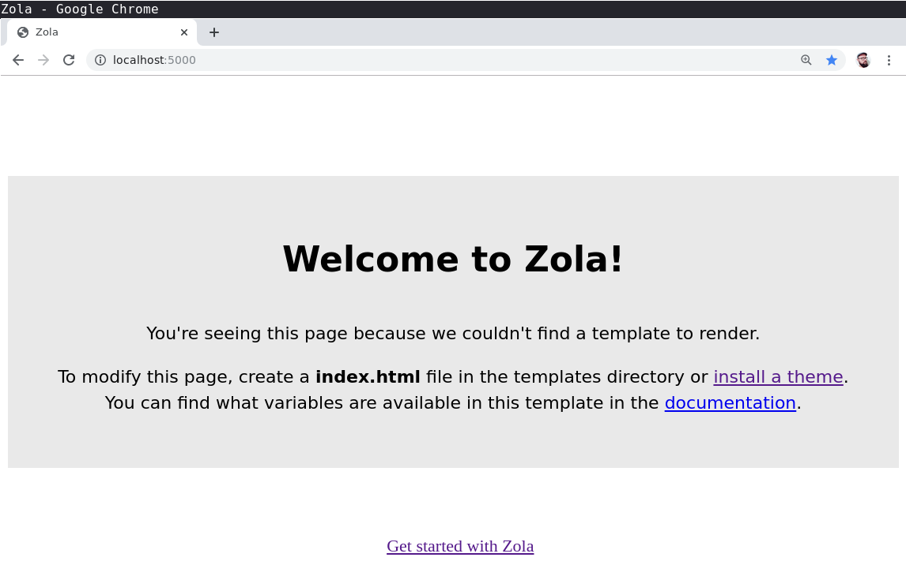

## Temas e Templates

Neste momento você pode escolher criar o seu front-end do zero, a [documentação](https://www.getzola.org/documentation/templates/overview/) explica muito bem como fazer isso.

Porém a melhor opção é utilizar um dos temas prontos disponíveis na [página de temas](https://www.getzola.org/themes/).

Mesmo que o tema não te agrade 100% você poderá customizar apenas as partes que desejar utilizando o diretório `templates`.

### Instalando um tema.

O tema mais simples é o [hyde](https://zola-hyde.netlify.com/) vamos então instalar e começar a utilizar ele para criar nossos conteúdos.

Primeiro faça download to tema para a sua pasta `themes`:

```bash
cd themes
git clone https://github.com/getzola/hyde.git
cd ..
```

agora edite o arquivo `config.toml` e adicione logo antes de `[extra]`:

```toml
theme = "hyde"
description = "Meu blog Maravilhoso"
title = "Meu Blog"
```

E algumas [configurações especificas](https://github.com/getzola/hyde#options) to tema na seção `[extra]` do `config.toml`:

```toml
[extra]
hyde_links = [
    {url = "https://google.com", name = "Google.com"},
    {url = "https://google.fr", name = "Google.fr"},
]
hyde_sticky = false
hyde_theme = "theme-base-08"
hyde_reverse = true
```

Neste momento ao acessar o blog já será possivel notar a diferença mas ainda falta conteúdo!

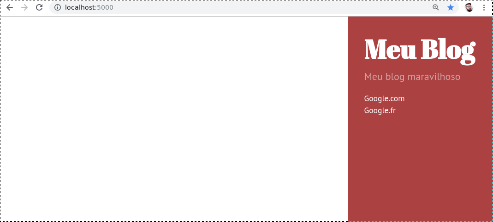

## Escrevendo conteúdo no Zola

Todo o conteúdo será escrito na pasta `content/` e o funcionamento é bastante simples:

- `content/nome-da-postagem.md` - Qualquer arquivo **markdown** é considerado um novo **post**, ou seja, para postar no blog basta criar um novo arquivo.
- `content/nome-da-postagem/index.md` - Um post tbm pode ser escrito em uma pasta contendo um `index.md` desta maneira podemos agregar outros formatos de arquivo em uma mesma postagem.
- `content/nome-da-postagem/foto.png` - Quando a postagem é colocada em uma pasta podemos agregar qualquer arquivo estático para linkar no diretamente conteúdo, por exemplo para inserir a imagem no markdown com ``.
- `_index.md` - Meta arquivo onde definimos [opções](https://www.getzola.org/documentation/content/section/#front-matter) de template, paginação e ordenação para uma seção, por exemplo, um `_index.md` na raiz da pasta `content` é onde definiremos as opções de listagem de conteúdo (índice do blog).
- `content/subpasta/nome-da-postagem.md` - Podemos organizar seções em subpastas.
- `content/subpasta/_index.md` - o arquivo `_index.md` será o meta indice da seção.

### Seu primeiro post

#### Meta dados

O **Zola** usa **front-matter** uma marcação especial que vai no topo dos arquivos **.md** utilizando a linguagem de marcação **toml** e com separador `+++`.

Na documentação tem a explicação de [todos os parâmetros permitidos](https://www.getzola.org/documentation/content/page/#front-matter).

#### Conteúdo

O conteúdo é escrito com **Markdown** e além de tudo o que o padrão do **Markdown** oferece 
o **Zola** ainda tem suporte a [shotcodes](https://www.getzola.org/documentation/content/shortcodes/) e [internal links](https://www.getzola.org/documentation/content/linking/) que são diretivas que extendem as funcionalidades do Markdown.

````md
+++
title = "Meu primeiro post"
date = 2019-11-14
draft = false
+++

É muito fácil criar uma postagem com **Zola**

Basta escrever Markdown com toda a sua maravilhosidade.

> É fácil acoplar um video do Youtube usando Shortcodes

{{/* youtube(id='u9rY0WhW0u0') */}}

---

## E também tem syntax-highlight

```python
def hello():
    return 'World
```
````

Salve o seu post em `content/2019-11-14-meu-primeiro-post.md` e acesse o blog:

> Não é obrigatório, mas é recomendado iniciar os arquivos com a data atual, desta forma na hora de editar no seu editor preferido você consegue ordenar por data facilmente.

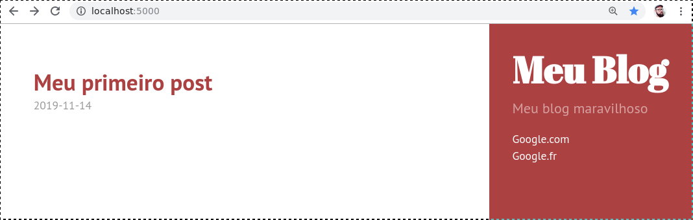

e ao clicar

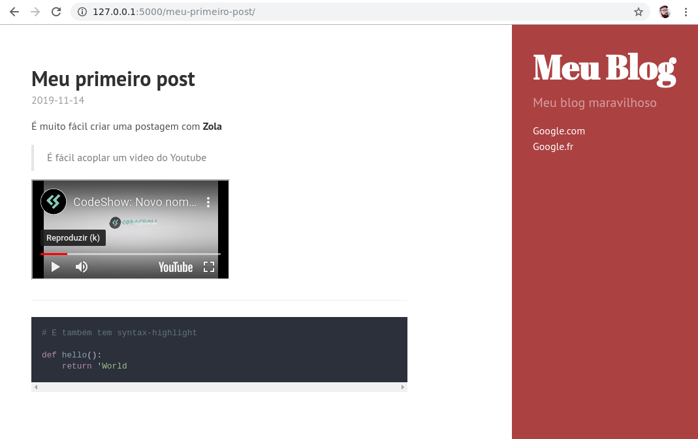

Agora é com você efetuar as cutomizações nos `templates/` para ter uma idéia pode olhar como eu fiz para este site em [https://github.com/codeshow/site](https://github.com/codeshow/site)

## Deploy gratuito e automatizado

O **Zola** cria um site estático, não tem bancos de dados ou serviços envolvidos portanto o deploy é bastante simples em qualquer servidor web, o output do seu site será criado em uma pasta chamada `public` e então basta mover os arquivos desta pasta para qualquer servidor web.

Para criar a pasta `public` localmente basta rodar `$ ./zola build` e então o site é gerado.

Mas... nós queremos automatizar o processo, toda vez que criarmos ou editarmos um post queremos que o site seja gerado e as páginas atualizadas em nosso servidor.

É bem tranquilo fazer isso com o [Travis](https://www.getzola.org/documentation/deployment/github-pages/#travis-ci), porém o **Zola** tem um processo ainda mais fácil utilizando o **Netlify**

### Repositório

Para começar precisamos que o site esteja em um repositório público no github pois é de lá que o Netlify vai ler os arquivos, você pode ver um exemplo no repositório deste blog [https://github.com/codeshow/site](https://github.com/codeshow/site).

> Se a sua pasta `blog` ainda não é um repositório execute `$ git init` para transforma-la em um.

> **detalhe** a pasta `themes/hyde` é um submodulo git, portanto pode ser necessário rodar `git submodule init` para incluir esta referencia no git.

Assim que o seu site estiver no Github/Gitlab por exemplo em `https://github.com/voce/blog` contendo em sua raiz o arquivo `config.toml` e o binário `zola` podemos então passar para a automatização de deploy no Netlify.

Na raiz do repositório crie um arquivo `netlify.toml` com o seguinte conteúdo.

```toml
[build]
# caminho onde o site será gerado.
publish = "public"

# comando que irá gerar o site
command = "zola build"

[build.environment]
# A versão do Zola para informar ao Netlify
ZOLA_VERSION = "0.9.0"

# Para possibilitar a geração de um site de preview para todo
# Pull Request precisamos fazer a alteração da url base.

[context.deploy-preview]
command = "zola build --base-url $DEPLOY_PRIME_URL"
```

Com este arquivo na raiz do repositório o Zola vai conseguir fazer o build automaticamente e publicar o site sempre que houver alterações no Git.

**lembre-se de fazer o commit e push deste arquivo para o repositório publico no github ou gitlab!!!**

A estrutura do repositório deve ser como esta:

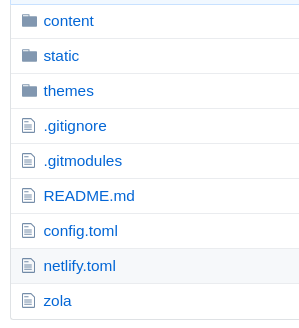

### Netlify

Entre em [netlify.com](http://netlify.com) e crie sua conta ou faça login na conta existente. No dashboard clique em `New Site From Git` e crie o seu site.

Escolha o serviço **Github** ou **Gitlab** onde está o seu repositório e então prossiga para a escolha do repositório.

O Netlify vai ler o arquivo `netlify.toml` e preencher o formulario automaticamente.

Apenas confira se está tudo certo no formulário e clique em `Deploy Site`

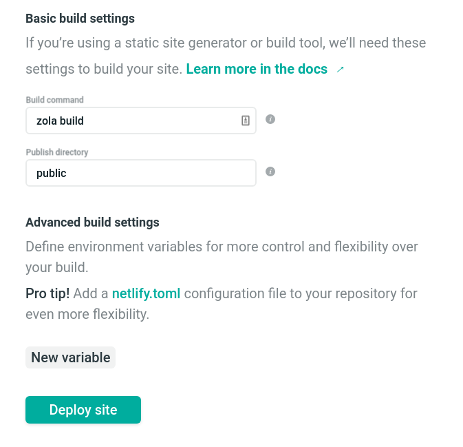

Assim que for feito o primeiro build e deploy o **Netlify** vai criar uma URL temporária para o seu site, você poderá alterar esta URL ou até mesmo utilizar seu próprio dominio clicando em `Domain Settings`.

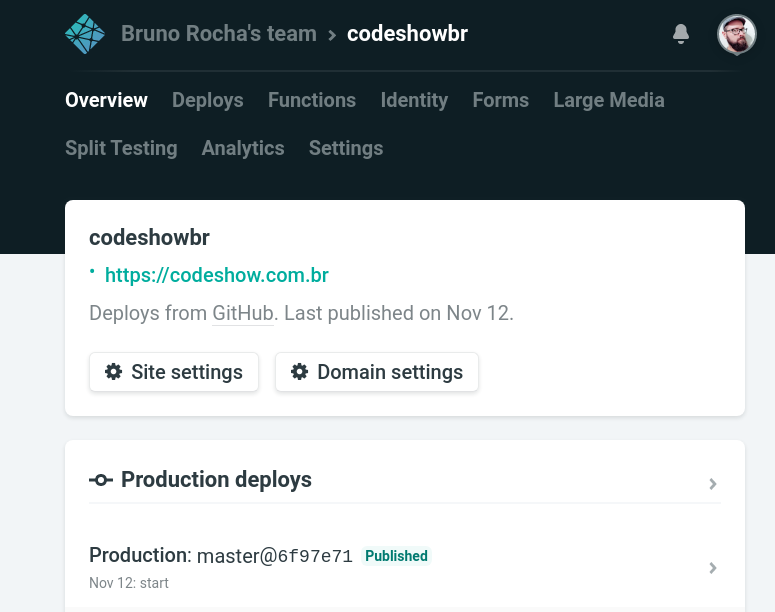

O **Netlify** tem algumas features interessantes como por exemplo a captura de [formulários HTML](https://docs.netlify.com/forms/setup/) e as [serverless functions](https://docs.netlify.com/functions/overview/#manage-your-serverless-functions) caso necessite.

### Adicionando Novo Conteúdo

Agora ficou fácil adicionar um novo conteúdo, você pode fazer isso localmente usando seu editor de markdown favorito (eu uso o VsCode) ou pode até fazer usando a própria UI do Github que vai funcionar perfeitamente.

A minha única recomendação é que você sempre crie uma branch nova e envie o novo conteúdo através de um Pull Request, pois desta forma o **Netlify** cria um site de preview do PR.

Através da interface web do Github é simples, basta ir na pasta `content/` e criar em **create new file**.

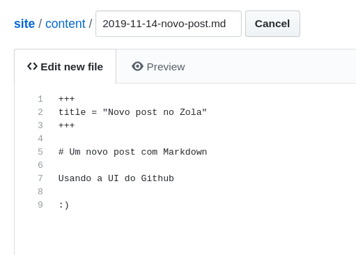

Assim que terminar de editar o seu post basta escolher para criar uma nova `branch`

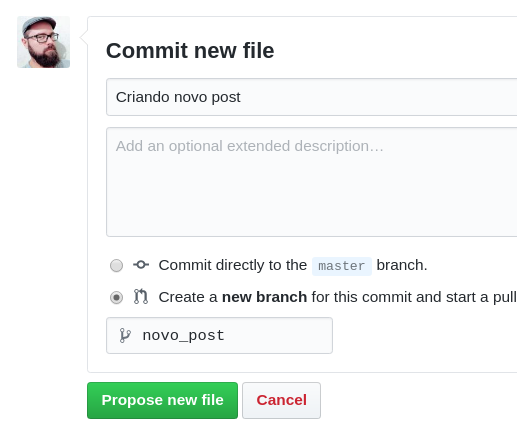

E então ao criar o novo **Pull Request** a partir deste branch o Netlify irá gerar um site de preview.

Para fazer tudo isso ai localmente via linha de comando:

```bash
# Ignore caso tenha feito através da UI do Github.

# cria uma nova branch local
git checkout -b new_post  

# Edite o arquivo localmente
code content/2019-11-14-novo-post.md

# Quando terminar envie para o github
git add content/2019-11-14-novo-post.md
git commit -am "Adicionando o novo post"
git push -u origin HEAD
```

Agora basta ir lá na UI do Github e criar o Pull Request. (ou fazer na linha de comando caso você utilize a ferramenta `hub`)

Assim que o PR for criado usando qualquer um dos modos acima o Netlify vai detectar e fazer o build do site.

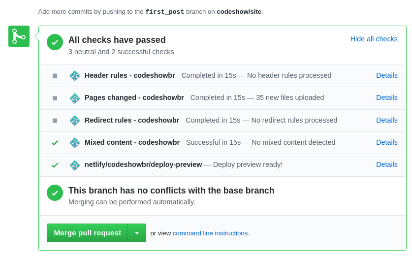

Basta clicar em `details` do último check `netlify/codeshowbr/deploy-preview` e você poderá ver como o site ficou antes de fazer o merge do Pull Request.

A página de deploys do **Netlify** vai te mostrar o status de cada build.

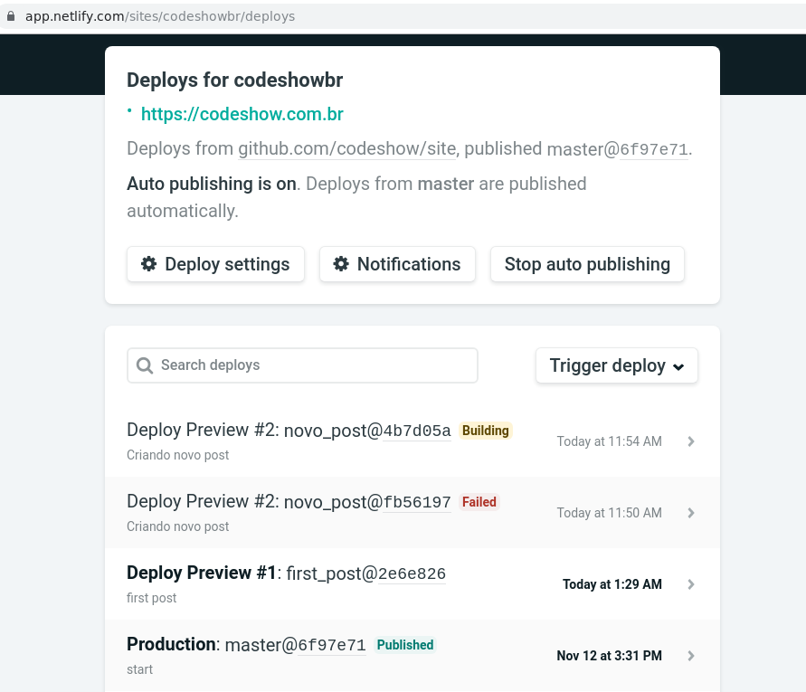

## Conclusão

Pronto! a partir de agora basta criar um novo arquivo **markdown** no seu repositório e o seu site será atualizado.

Explore as features do Netlify e do Zola tem muito mais coisa legal que pode ser feita.

Caso você descubra uma dica legal por favor compartilhe nos comentários!

## Referências

- **Zola** - [https://getzola.org](https://getzola.org)
- **Netlify** - [https://netlify.com](https://netlify.com)
- **VSCode** -  [https://code.visualstudio.com](https://code.visualstudio.com)

{{ embeds(audio="01---CodeShow---Como-criar-um-blog-ou-site-esttico-usando-Zola--Github-e-Netlify-e90imp")}}

---
