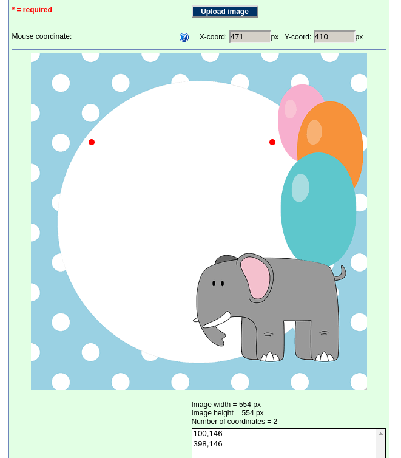

+++
title = "Criando convites com Python"
date = 2019-12-05T11:00:00Z
draft = false

[taxonomies]
tags = ["python"]
categories = ["tutorial"]

[extra]
author = "rochacbruno"
comments = true
+++

# Faça convites de aniversário com Python

{{ resize_image(path="2019-12-05-criar-convite-com-python/top.jpg", class='top') }}

A motivação para este artigo é que meu filho está prestes a completar um ano e nós precisavámos convidar as pessoas da família para a festa de aniversário e mesmo sendo para poucas pessoas queriamos enviar um convite para todos em formato digital através do whats-app/e-mail.

A minha esposa criou um template base para o convite com o tema da festa e eu então usei um script Python para preencher o nome dos convidados e gerar as imagens para serem enviadas.

A idéia é usar a [PILlow](http://python-pillow.org/) que é a versão mais atual da Python Imaging Library (PIL) e com esta biblioteca usar ferramentas de desenho para inserir linhas, formas geométricas e texto em cima do template base que foi criado.

## Instalação

Em um ambiente Python 3.6+ (recomendo o 3.8)

```bash
python -m pip install pillow
```

## Preparando o projeto

Como exemplo deste artigo eu peguei uma imagem que encontrei na internet e que estava com direitos de uso livre.


E o objectivo aqui é a partir de uma lista de convidados como esta:

```python
CONVIDADOS = ["Karla", "Erik", "Oliver", "Guido", ...]
```

Gerar um novo convite com o texto personalizado contendo o nome do convidado.

Aliás está é uma dica muito importante, ao fazer convites digitais sempre faça nominal, pois é muito fácil ocorrer o compartilhamento de imagens via e-mail ou outros mensageiros e portanto é importante que a imagem seja de uso único senão a sua festa pode sair do seu controle :)

Outra dica é usar a imagem quadrada, pois nessas dimensões é mais garantida uma melhor visualização independente do mensageiro onde ela será enviada.

O objetivo então é preencher o template com texto e uma linha, assim:


A primeira coisa que precisamos saber é quais as coordenadas para os pontos da imagem onde iremos desenhar ou escrever e para isso eu usei uma ferramenta online chamada [mobilefish](https://www.mobilefish.com/services/record_mouse_coordinates/record_mouse_coordinates.php) que é bem simples de usar, basta fazer o upload da imagem e então usar o mouse para definir os pontos e então na caixa de texto abaixo as coordenadas serão mostradas, copiaremos estas coordenadas para usar no código.



Na imagem acima perceba que temos marcados 2 pontos, e na caixa abaixo as coordenadas X,Y de cada um dos pontos, nós vamos desenhar uma linha reta entre esses 2 pontos.

## Abrindo o template e desenhando uma linha

Agora crie um script Python chamado de `convite.py`:

```python
1 from PIL import Image, ImageDraw
2 
3 imagem = Image.open("./template.png").convert("RGBA")
4 lapis = ImageDraw.Draw(imagem)
5 lapis.line((100, 146, 398, 146), fill="#ccc", width=5)
6 image.save("./nova_imagem.png")
```

### Explicando o código acima linha a linha

- Na linha `1` importamos as classes `Image` que será usada para instanciar nossa imagem de template e a classe `ImageDraw` que é a ferramenta usada para desenhar sobre a imagem.
- Na linha `3` abrimos a imagem `template.png` e aproveitamos para converte-la para o modo `RGBA` pois assim fica mais fácil para trabalharmos com os códigos de cores em hexadecimal.
- Na linha `4` criamos uma instância de `ImageDraw.Draw` que sugestivamente chamamos de `lapis`.
- Na linha `5` usamos o lápis para desenhar uma linha na `imagem` e para isso passamos as coordenadas de `X,Y` que pegamos da imagem, passmos também uma cor em formato hexadecimal `#ccc` e a largura da linha com `width=5`.
- Na linha `6` salvamos uma nova imagem com as nossas alterações.

O resultado será:


Apesar de termos escrito 5 linhas de código a linha que efetivamente desenhou na imagem foi essa:

```py
lapis.line((100, 146, 398, 146), fill="#ccc", width=5)
```

E agora partindo deste exemplo e usando essas coordenadas como base podemos desenhar outras linhas, retângulos, circulos ou colocar texto na imagem.

## Inserindo texto

Para inserir texto na imagem usaremos o método `lapis.text` mas antes precisaremos de uma fonte, para isntanciar uma fonte usaremos a classe `ImageFont`

```python
1 from PIL import Image, ImageDraw, ImageFont
...
6 font = ImageFont.truetype("font.ttf", size=35)
7 lapis.text((125, 100), text="Olá Fulano", fill="#000", font=font)
8 image.save("./nova_imagem.png")
```

### Explicando o código acima linha a linha

- Na linha `1` adicionamos o import da classe `ImageFont`
- Na linha `6` criamos uma nova instância de `ImageFont` passando o caminho para um arquivo de font com a extensão `.ttf` e você pode baixar algumas fonte no site [1001freefonts](https://www.1001freefonts.com/) e além disso especificamos o tamanho da fonte com `size=35`.
- Na linha `7` usamos o `lapis.text` para escrever "Olá Fulano" na imagem mas desta vez não precisamos passar coordenadas para 2 pontos, pois este método precisa saber apenas qual o ponto onde o texto começará já que seu tamanho dependerá da quantidade de caracteres escritos, e setamos também uma cor `#000` e qual fonte que será usada.
- Na linha `8` salvamos uma nova imagem com as nossas alterações.

O resultado será:


## O que mais podemos fazer?

Acredito que já deu para perceber que agora é só seguir o mesmo padrão e usar os métodos de desenho que desejar atentando-se para a posição das coordenadas que podem ser obtidas usando a ferramenta online citada enteriormente ou qualquer editor de imagens que contenha uma régua.

Um código completo para gerar convites para nossa lista de convidados ficaria assim:

```python
from PIL import Image, ImageDraw, ImageFont


CONVIDADOS = ["Karla", "Erik", "Oliver", "Guido"]

LEFT_BORDER = 100

font1 = ImageFont.truetype("./font1.ttf", size=35)
font2 = ImageFont.truetype("./font2.ttf", size=35)


for convidado in CONVIDADOS:
    imagem = Image.open("./template.png").convert("RGBA")

    lapis = ImageDraw.Draw(imagem)

    lapis.text(
        (125, 100), 
        text=f"Olá {convidado}", 
        fill="#000", 
        font=font1
    )

    lapis.line(
        (LEFT_BORDER, 145, 398, 145), 
        fill="#ccc", 
        width=5
    )

    lapis.text(
        (LEFT_BORDER, 160),
        text="Venha ao meu aniversário",
        fill="#000",
        font=font2,
    )

    lapis.text(
        (LEFT_BORDER, 200), 
        text="Dia 31/03/2020", 
        fill="#000", 
        font=font2
    )

    lapis.text(
        (LEFT_BORDER, 280), 
        text="Abraços!", 
        fill="#000", 
        font=font2
    )

    imagem.save(f"./convite_{convidado}.png")

```

E o resultado será a criação de um arquivo de imagem por convidado como este exemplo:

`convite_Erik.png`


Agora é só usar sua imaginação e talentos artisticos para explorar os métodos de desenho de `ImageDraw` e também os filtros de `ImageFilter`.

Mais detalhes estão no vídeo publicado no [YouTube do Codeshow](https://youtu.be/Qbyulb4P3UQ) e nas referências linkadas abaixo.

## Conclusão

Pare de imprimir convites e faça convites personalizados com Python. Ahh e por favor NÃO USE ISSO PARA FAZER SPAM!!! :)

## Referências

- **Pillow** - [PILlow](http://python-pillow.org/)
- **Coordenadas** - [MobileFish](https://www.mobilefish.com/services/record_mouse_coordinates/record_mouse_coordinates.php)
- **Fontes** -  [https://www.1001freefonts.com/](https://www.1001freefonts.com/)
- **Tutorial de PIL** - [https://note.nkmk.me/en/python-pillow-basic/](https://note.nkmk.me/en/python-pillow-basic/)

{{ embeds(video="Qbyulb4P3UQ")}}
